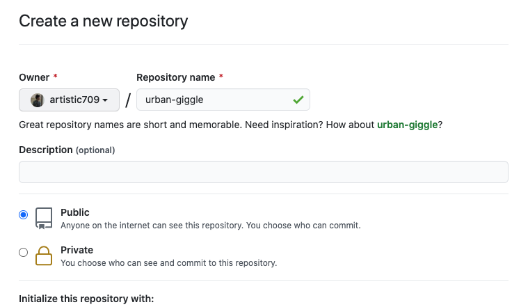

# urban-giggle

Hakka Finance audit 2021-1

### nomenclature

	

## Thank You Token
**Proof of donation** token modified from [WETH](https://weth.io/) 
* [0x7F8093f5F49a9D7F0334f8017fF777F1893032d5](https://etherscan.io/address/0x7F8093f5F49a9D7F0334f8017fF777F1893032d5)

## Vesting Vault
A [Vesting Contract](https://medium.com/hakkafinance/vesting-contract-9ab2ff24bf76) for HAKKA liquidity mining reward
* [0x51F12323820b3c0077864990d9E6aD9604238Ed6](https://etherscan.io/address/0x51F12323820b3c0077864990d9E6aD9604238Ed6)

## Vesting Reward Contract
A modified contract of Synthetix liquidity mining reward contract  
(Mined token goes to vesting contract instead of user's address when withdrawn)

## Hakka Intelligence
[Prediction market-like](https://medium.com/hakkafinance/hakka-intelligence-24a819db9dd0) contract to bet on price changes
* [Website](http://intelligence.hakka.finance/)

## iGain
[A tokenized derivative](https://medium.com/hakkafinance/igain-introduction-29da2834500f) of AMM impermanent loss
* [SheetyDApp](http://igain.hakka.finance/)
* [Wiki](https://hakkafinance.gitbook.io/igain/)
* [iGain formula](https://hackmd.io/pbF87K5OSwibyiOwjrmvcg)
